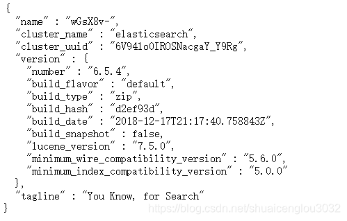
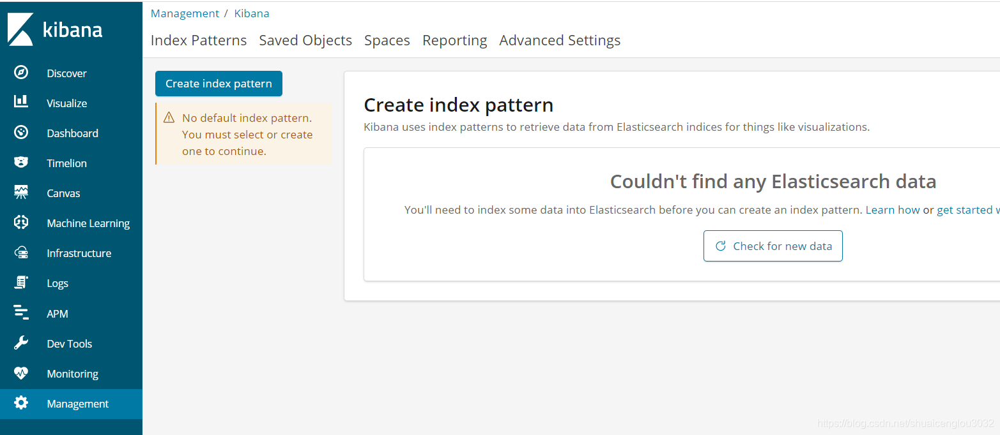
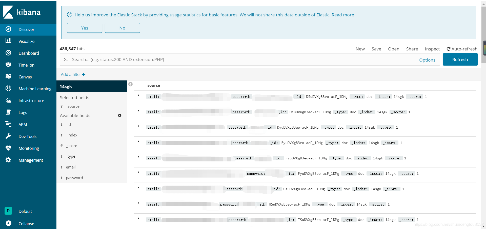

​本文不包含社工库的任何数据。作者既没有，也不会给出任何数据源。  
ELK版本：  

1、elasticsearch-6.5.4  

2、kibana-6.5.4-windows-x86_64  

3、logstash-6.5.4  

elasticsearch主要用来做全文搜索，kibana是展示，logstash向elasticsearch写入数据。  

以上版本要求JDK7以上，我这里是JDK8。  
 
下载好之后解压，双击elasticsearch.bat，浏览器访问127.0.0.1:9200看到如下代码就说明elasticsearch成功运行：  
  


接下来运行kibana-6.5.4-windows-x86_64\bin\kibana.bat  

浏览器访问本机5601端口看到以下界面说明kibana运行成功：  

  

接下来配置logstash。  

在logstash\bin下面新建一个test.conf，内容如下：  
```bash
input {
	file {
		path => "D:/sgk/BreachCompilation/old/*.txt"
		start_position => "beginning"
	}
}

filter {
	csv {
		columns => ["email","password"]
		separator => ":"
	}
	mutate {
		remove_field => [ "message","path","host","@timestamp","@version"]
	}
}

output {
	stdout {
		codec => rubydebug
	}
	elasticsearch {
		hosts => ["127.0.0.1:9200"]
		index => "14sgk"
	}
}
```  
然后在logstash bin目录下面执行  
```Logstash.bat -f test.conf```  

向elasticsearch写入数据。  

然后我们访问5601端口：  
  


一个SGK就搭起来了。就是写数据比较慢，查询速度还是非常快的，另外对硬盘空间的要求也很高，算是空间换时间的典型了。

​
