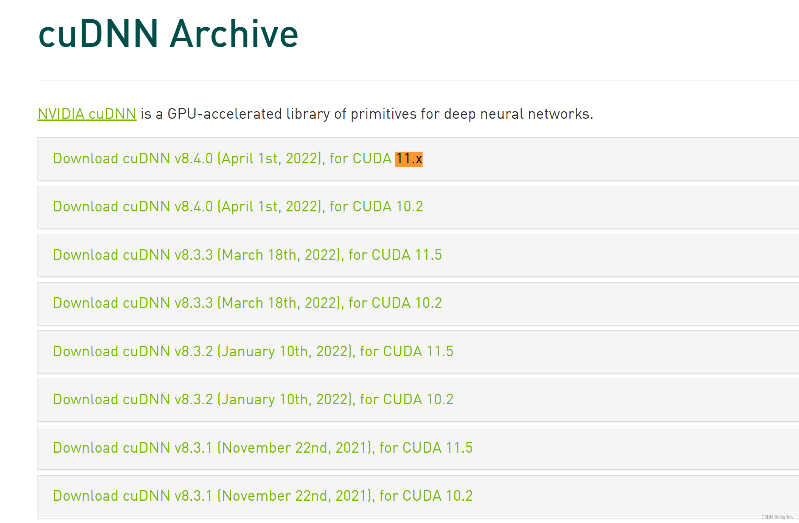

Bert是一种 NLP 预训练模型，本文不介绍 BERT 的原理，主要关注如何安装 BERT 模型并使用它生成词向量用于下游任务。
## 0.查看显卡型号和驱动
我的：

## 1.安装CUDA。
CUDA的安装这里不详细说，见下图,也可以见这篇[文章](https://blog.csdn.net/shuaicenglou3032/article/details/122998560?spm=1001.2014.3001.5502)：

我这里安装的是CUDA11.6
## 2.安装cuDNN
cuDNN的版本要和CUDA对应，不然会有问题，详见https://developer.nvidia.com/rdp/cudnn-archive

我这里使用的是cuDNN8.4.0 for CUDA11.x
注：cuDNN需要注册之后才能下载，之前的复制链接迅雷下载好像不行了，至少我没成功。然后注册的话在国内访问或者用qq邮箱我亲测会报错，目前完美的解决方案是架梯子，使用Gmail注册之后下载。

把cuDNN下载下来之后解压，把里面的三个文件夹的内容（注意是内容）分别移到CUDA安装目录里对应的同名文件夹里面。
其中include和bin文件夹的内容可以直接移动，lib文件夹内容要移动到lib\x64目录下。（这段话摘自[2022【超详细】搭建深度学习环境与配置 tensorflow2.7+keras2.7+CUDA11.6+cuDNN 对应版本](https://blog.csdn.net/jiuzixu/article/details/122518914)）

至此cuDNN安装完毕。

## 3.安装tensorflow
前提条件：需要python3.7以上版本，我这里随便选了个3.7.7:


这里注意不能安装最新版本的tensorflow，经过测试之后我选择1.14.0，至于为什么选择这个版本后面再说。
命令行安装:

```
pip3 install tensorflow==1.14.0
```

我为什么选择tensorflow1.14.0：
1.目前Bert不支持tensorflow2.0以上版本，所以需要选择1.x版本
2.按照一些教程的，安装tensorflow-gpu，在启动Bert服务端的时候会报错，所以选择tensorflow。
## 4.安装Bert以及下载预训练模型
bert-as-service 是腾讯 AI Lab 开源的一个 BERT 服务，它让用户可以以调用服务的方式使用 BERT 模型而不需要关注 BERT 的实现细节。bert-as-service 分为客户端和服务端，用户可以从 python 代码中调用服务，也可以通过 http 的方式访问。
```
pip3 install bert-serving-client
pip3 install bert-serving-server
```
下载预训练模型：
根据任务的类型和规模，Google 提供了多种预训练模型供选择：

BERT-Base, Chinese: 简繁体中文, 12-layer, 768-hidden, 12-heads, 110M parameters
BERT-Base, Multilingual Cased: 多语言（104 种）, 12-layer, 768-hidden, 12-heads, 110M parameters
BERT-Base, Uncased: 英文不区分大小写（全部转为小写）, 12-layer, 768-hidden, 12-heads, 110M parameters
BERT-Base, Cased: 英文区分大小写, 12-layer, 768-hidden, 12-heads , 110M parameters
以上四个见GitHub:
[https://github.com/google-research/bert](https://github.com/google-research/bert)

因为我是做英文的词嵌入，而且作为代码来说需要区分大小写，所以选择BERT-Base, Cased模型。
下载好模型之后解压：

## 5.启动Bert服务端

```
bert-serving-start -model_dir D:/ML/Bert/cased_L-12_H-768_A-12 -num_worker=2
```
还有很多参数可以调，具体参数说明见[bert用于文本相似性计算](https://www.jianshu.com/p/69d5f0471c66)

直到最后出现：all set, ready to serve request!才算成功。
## 6.简单使用
我这里用的是Pycharm，在Pycharm中新建的一个虚拟环境，因此Pycharm中也要安装bert-serving-client，这里不再赘述。
编写代码：
```python
from bert_serving.client import BertClient

bc = BertClient()
doc = bc.encode(['fuckyou','motherfucker'])
print(doc[0])
```
运行成功：

