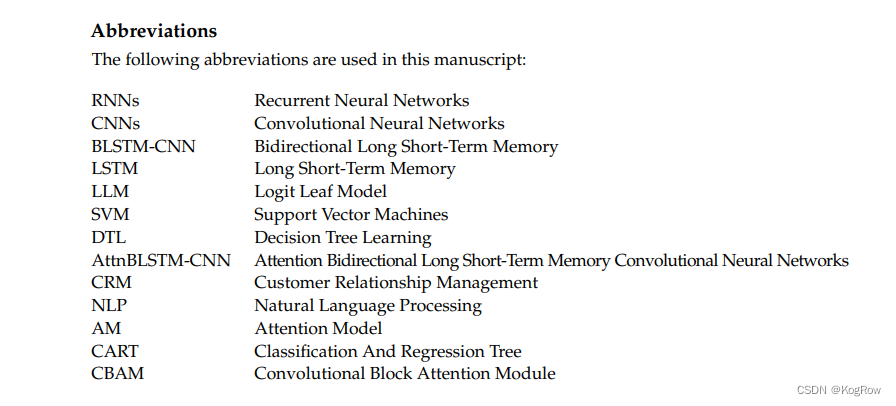
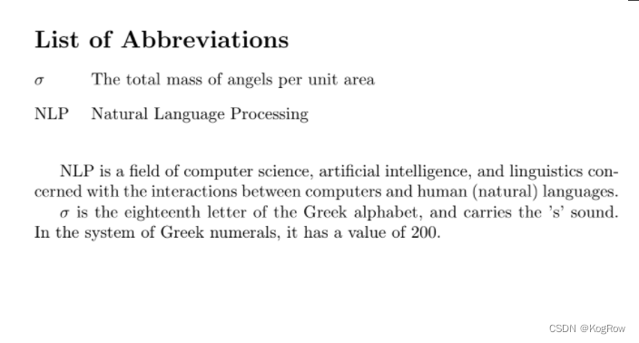

最近投稿的论文得了个大修，对着审稿人的十几条意见头皮发麻，其中一个审稿人要求我解释手稿内的每一个缩略词的详细含义，那还能怎么办，写吧。  
把手稿内的所有缩略词全部解释了一遍，想想还是不放心，我在别人的论文里看到过论文末尾有一个缩略词列表，就像这样：  
  
我寻思我也弄一个，做到尽善尽美。  
百度了一下之后，得到的步骤如下：  
1.首先在`\documentclass{article}`的下方引入nomencl包  
2.接着输入`\makenomenclature`  
3.然后自定义名字：`\renewcommand{\nomname}{List of Abbreviations}`  
4.手稿末尾使用`\nomenclature{}{}`自行编写缩略词  
一个完整的示例如下：  

```bash
\documentclass{article}

\usepackage{nomencl}
\makenomenclature

\renewcommand{\nomname}{List of Abbreviations}

\begin{document}

\printnomenclature 
\hfill % add blank space

NLP is a field of computer science, artificial intelligence, and linguistics concerned with the interactions between computers and human (natural) languages.

\nomenclature{NLP}{Natural Language Processing}

$\sigma$ is the eighteenth letter of the Greek alphabet, and carries the 's' sound. In the system of Greek numerals, it has a value of 200. 

\nomenclature{$\sigma$}{The total mass of angels per unit area}

\end{document}
```  
效果：  
  
-------end--------  
