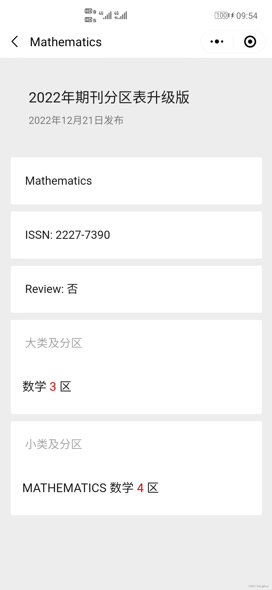
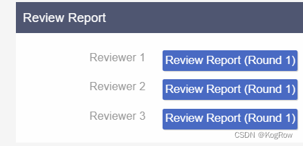
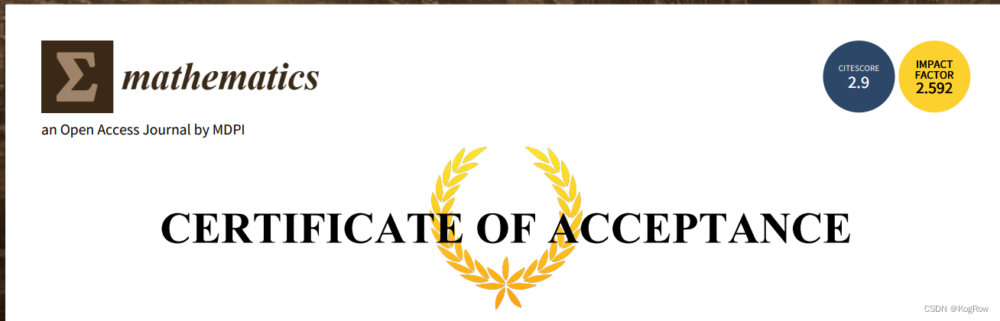

  最近写了篇论文，由于国内期刊现状（懂的都懂），打算投国外的期刊，看来看去选择投MDPI旗下的Mathematics。手稿经过一轮大修之后顺利收到了Accepted，从投稿到接收共一个月左右，过程还是比较顺利的，记录一下投稿过程。
《Mathematics》的影响因子虽然只有1.747分,但好歹也是SCIE收录的期刊，在数学领域位于 JCR一区，中科院分区里数学大类3区，小类4区，还行：  
注：继浙江工商大学之后，近日安徽省立医院（中国科学技术大学附属第一医院）将Hindawi，MDPI，Frontiers三大出版社的系列期刊，均纳入“提醒期刊”，虽然这是一个新名词，看似较“黑名单”轻，但实际无不同：不建议投稿，不予报销版面费，不纳入科研绩效统计。而MDPI正是Mathematics的出版商。
下次不投它家了，投个不开源的SCI二区期刊，体验一下被审稿人毒打的滋味。    
    

12.11 pending review  
12.13 under review  
12.30 major review  
1.6 resubmitted  
1.7 revised version review  
1.9 Pending editor decision  
1.10 acceptance  
1.11 pending English  
1.12 English correction done  
1.14 Pending conversion  
1.15 Website online  

## 论文撰写

1.撰写这个过程就很痛苦了，我8月份做实验做到11月，然后花了半个月写中文初稿，写完之后花了两三天时间修改，然后又花了三天时间将中文初稿翻译成英文。  
2.查重 英文初稿查重21%，又熬了一个通宵降重到7%  

## 排版
  论文写好之后就要按照期刊的模板来排版，开始我用的是word，但是做完之后发现格式怎么都调不对。研究之后改用Latex来排版，哎，又浪费一天时间。  
  MDPI有很方便排版的latex模板，直接拿来用就行。这里我用overleaf在线进行latex排版，又花了一天时间。  
Mathematics建议作者制作图文摘要（Graphical Abstract），然后还需要写求职信（Cover Letter），弄这个又花了半天。  

## 投稿
Latex排版完毕，接下来就是投稿了。  
首先在MDPI注册一个账号然后把Latex稿件，图文摘要和求职信一并上传上去  
投稿时要选投的方向，还有特刊（特刊对投稿截止日期有要求，而且我后面听说特刊是有专门的审稿人的，所以审稿比较快）  
这里我不知道有啥区别，就随便选了。  
此外投稿时还需要写作者简介，虽然没带星号但不填没法投稿。  

## 审稿
投稿完会分配编辑，编辑会发邮件要求确认处理费，以及确认稿件的一些细节（比如要求作者提供Mathematics Subject Classification code），比如是否公开审稿人评论以及作者回复（Open Review）等，然后就到审稿环节了。  
PS:中间编辑还发邮件来要求我提供edu的邮箱，我打太极说邮箱还在申请所以是用的163邮箱，编辑也没说什么就过了。  
## 大修
Mathematics审稿挺快的，过了一个多星期审稿人的意见就返回来了。  
三个审稿人，一个给了3个yes，2个can，1个must be，一个给了1个yes，3个must be，2个can，第三个审稿人全部给了can。编辑给的大修（Major Revisions）。  
大修也很痛苦啊，每个审稿人的意见都要逐一详细回复，然后还得再写一封求职信。我对着三个审稿人的十几条意见头皮发麻  
大修花了一个星期，又熬了几个通宵  

全部修改完之后把所有改动放在一个pdf里连同修改后的Latex手稿和求职信重新提交  
然后审稿系统里还得对每个审稿人的问题进行逐一回复：  
  
虽然大修很痛苦，但是当你遇到靠谱的审稿人的时候，他会非常尽职尽责地从方方面面给你的文章提出建议，促使你的文章变得更好，说实话大修做完我感觉我的写论文的能力都有了巨大的进步，这才是投文章的关键。这里还是得感谢那位提了一大堆问题的审稿人。  

## 录用
重新提交完之后很快就变成Pending Editor Decision。  
第二位审稿人的意见很快就返回来了：说作者连同其他审稿人的意见对手稿进行了修改，相比之前的版本有了很大的改进，建议出版。给了5个yes和1个can  

又过了两天就收到了Accepted的邮件，投稿系统里状态也变成了paper accepted，还有一个接收证书：  
  
paper accepted第二天就显示English correction done。交了费应该就能出版了，哈哈  

## 作者校对
录用了就等着出版？天真。  
还有一个环节叫作者校对（Author proofreading）  
这步编辑又发来英语编辑完的邮件，要求作者校对，并对英语编辑过程中提出的问题进行修改及回复：  
    Please confirm, revise, or reply to all the comments left by us in the tex file (comments correspond to the highlighted parts in the pdf file), both in the main text and in the reference part. Each highlight in the PDF file has corresponding modification suggestions in the text file (please see attachment). Please revise and answer all point by point in the .tex file. The more specific comments are written the .tex
file starting with "%MDPI".  

而且时间特别紧急，要在24小时内完成，我又连夜整改了提交校对后的稿件。。。  

## 交费

然后就是交费了，1800瑞士法郎（2023年涨到了2100瑞士法郎）啊。。。。我的心都在滴血  

交费完当天就Pending conversion，然后就Website online了。  

------end  

