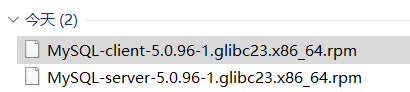
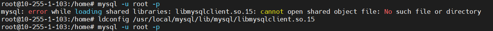
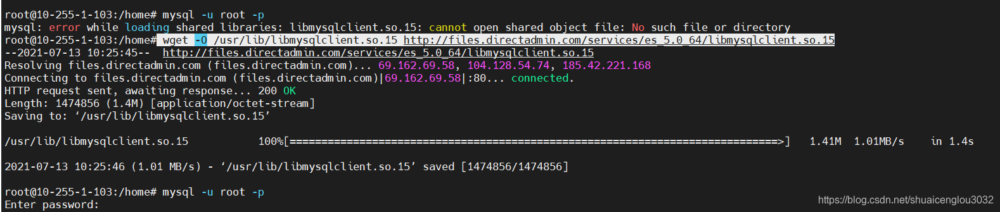

环境：Ubuntu18.04 64位  

使用rpm安装Mysql5.0.96:  
  

```bash
安装MySQL-client-5.0.96-1.glibc23.x86_64.rpm

rpm -ivh MySQL-client-5.0.96-1.glibc23.x86_64.rpm --force --nodeps

安装MySQL-server-5.0.96-1.glibc23.x86_64.rpm

rpm -ivh MySQL-server-5.0.96-1.glibc23.x86_64.rpm --force --nodeps
```
安装完成之后mysql -u root -p启动时报错：  

error while loading shared libraries: libmysqlclient.so.15: cannot open shared object file: No such file or directory  
    

解决办法：  
  
直接wget获取这个动态链接库保存到/usr/lib就能解决问题：    
```bash
 wget -O /usr/lib/libmysqlclient.so.15 http://files.directadmin.com/services/es_5.0_64/libmysqlclient.so.15
```


