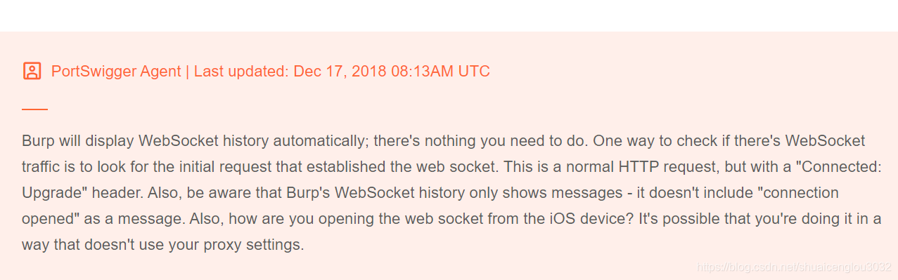
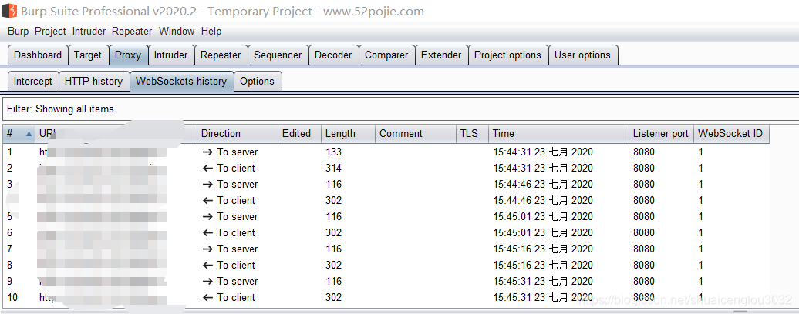

根据其在官网的说法，只需要配置好了代理，WebSocket的请求是可以监听到的,而且不再需要做其他额外的配置：  
  
但我尝试监听Websocket请求的时候，Omega报错：部分资源加载失败，然后请求也发不出去，抓包直接抓不到相关数据包。  
所以猜测是burp的版本过低，虽然其1.6版本也有所谓的Websocket History，但是根本没用。  
所以我这次直接上最新版的Burp,然后就监听到了websocket的流量：  
  
而且新版还能对websocket的请求进行重放了，非常好。  
