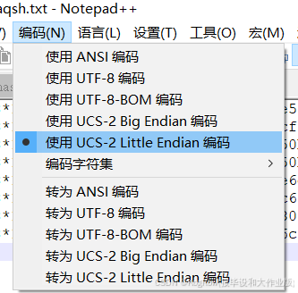
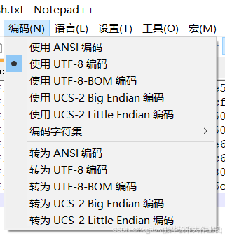

## 0x00 前提
1.已经将hash放在txt文件中  
2.hash格式无误  
## 0x01 网络上的原因
1.确认你指定的哈希类型参数正确无误。例如，如果你正在尝试破解一个MD5哈希，确保使用了正确的选项，如 --hash-type=4。  
2.检查输入文件是否为空或者格式是否正确。  
3.确认输入文件没有被损坏，并且是在 hashcat 支持的格式下生成的。  

## 0x02 我的发现：TXT格式编码问题造成的hashcat读取报错  
我直接使用 >> hash.txt将计算出来的hash放进txt，结果hashcat在读取的时候就报错了：  
signature unmatched   
no hashes loaded  

经过排查，我们可以看到，windows10下直接在命令行或者powershell使用>>命令将哈希输出到txt之后，txt的文件编码是UCS-2 Little Endian：  
  
而右键新建的txt，再把哈希放进去，编码就是UTF-8：  
  
而hashcat读取编码是UCS-2 Little Endian的txt的时候就会报错。  
解决方案：直接右键新建txt，把john计算出来的hash从命令行复制粘贴进去再用hashcat读取之后破解。  
