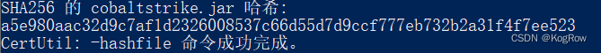
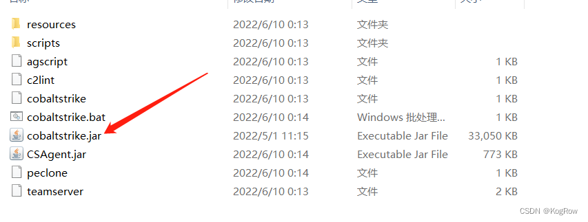
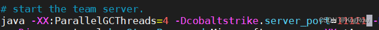
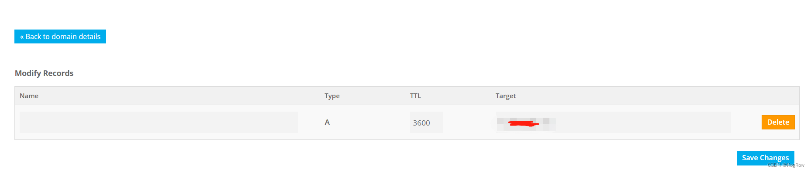
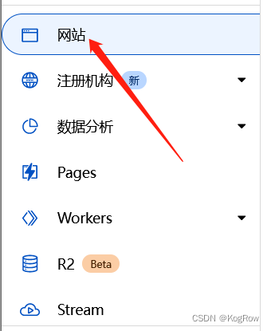
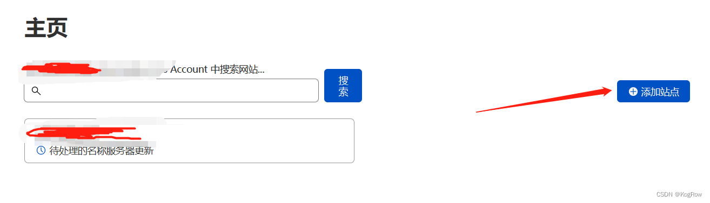
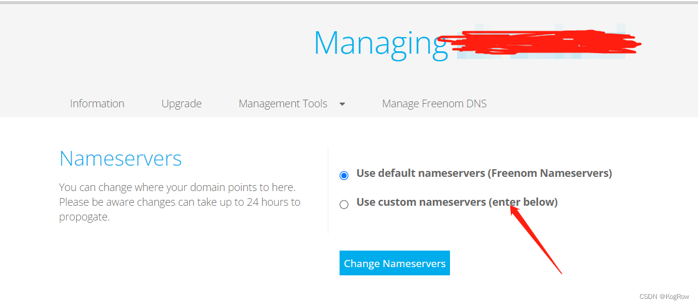
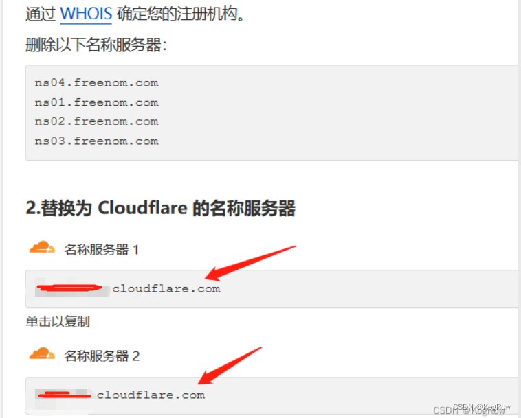
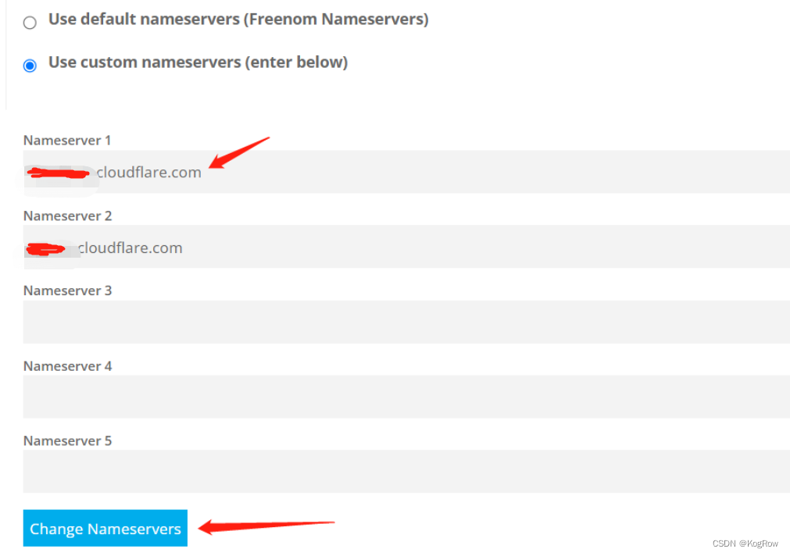
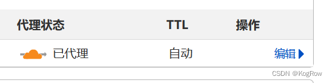

## 0x00 搭建Cobalt Strike
### 1.下载cs4.5
校验哈希：a5e980aac32d9c7af1d2326008537c66d55d7d9ccf777eb732b2a31f4f7ee523  

### 2.破解汉化
注：破解汉化是否有后门未知，这里放在虚拟机中运行。  
下载[CSAgent v1.3](https://github.com/Twi1ight/CSAgent/releases/tag/v1.3)，然后解压，将cobaltstrike.jsr放入解压之后的文件夹：  
  
然后就可以正常使用了。
## 0x01 更改CS端口
CS端口直接修改teamserver文件，比如端口改成11111：
  
## 0x02 域名接入CDN  
这里修改证书不是指的使用 keytool修改keystore，而是使用第三方提供的证书生成 keystore。  
为此我们需要用到域名和CDN。  
### 1.申请一个免费域名，这里在freenom上弄，其中的坑可以看这篇[文章](http://www.360doc.com/content/21/0124/00/30583588_958609144.shtml)：  
这里我们申请好一个域名之后添加一条DNS A记录，把域名解析到vps上。  

### 2.注册一个Cloudflare账号，使用Cloudflare的CDN。
注册Cloudflare账号不需要多说，邮箱建议也用匿名的protonmail。  
注册完之后点击网站：  

然后点添加站点：  

把在freenom弄到的域名添加进去，上面的图片中就会出现“待处理的名称服务器更新”这一个栏目。  
### 3.完成名称服务器设置
回到freenom，点击Services---->My Domains---->Management Tools---->NameServers，选择Use custom nameservers(enter below)  

把cloudflare的两个nameserver（中文翻译过来叫名称服务器）地址复制过来放上去：

此外，还需要进入到你注册CLOUDFLARE使用的邮箱里面，在收到的cloudflare验证邮件里面点击verify，将邮箱完成验证即可。  
配完上述操作等一段时间在CLOUDFLARE上就会看见下图：  

这里验证一下：ping我们买的域名，可以发现DNS找到的是Cloudflare的CDN节点，我们的真实IP被成功隐藏了。
