## 0x00 前言

## 0x01 测试环境  
windows7专业版SP1：  
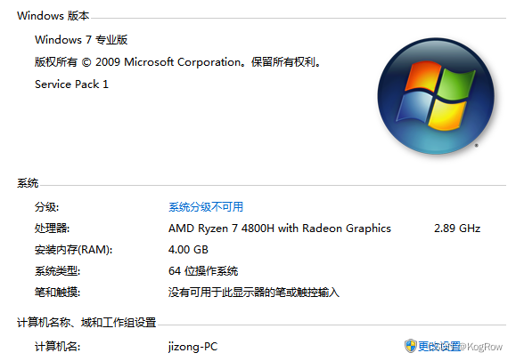  
在虚拟机中运行，创建了快照，当前账户名和密码为jizong/123456    

## 0x02 EFS加解密原理：
EFS加密实际上综合了对称加密和不对称加密，具体流程如下：  
(1) 随机生成一个文件加密密钥(叫做FEK)，用来加密和解密文件。  
(2) 这个FEK会被当前帐户的公钥进行加密，加密后的FEK副本保存在文件$EFS属性的DDF字段里。  
(3) 要想解密文件，首先必须用当前用户的私钥去解密FEK，然后用FEK去解密文件。  
除了上面的步骤，操作系统还会对EFS添加两层保护措施：  

(1) Windows会用64字节的主密钥(Master Key)对私钥进行加密，这个私钥并非系统安装之后就存在，而是第一次进行加密时生成，下图可以看到，刚安装的新系统中不存在Crypto文件夹。加密后的私钥保存在以下文件夹：
　　%UserProfile%\Application Data\Microsoft\Crypto\RSA\SID
　　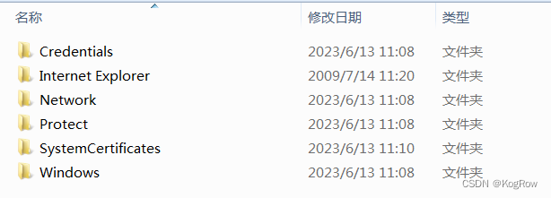

Windows系统里的各种私有密钥，都用相应的主密钥进行加密。Windows Vista的BitLocker加密，也用其主密钥对FVEK(全卷加密密钥)进行加密。

(2) 为了保护主密钥，系统会对主密钥本身进行加密(使用的密钥由帐户密码派生而来)，加密后的主密钥保存在以下文件夹：
　　%UserProfile%\Application Data\Microsoft\Protect\SID

## 0x03 各个密钥存放位置
1.加密后的主密钥：
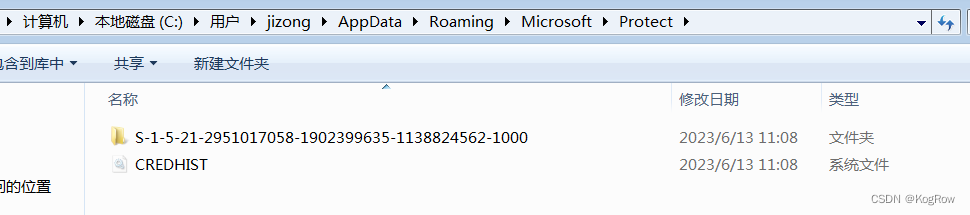
2.使用主密钥加密后的私钥：
（这里选择一个文件，对其点击“加密内容以便保护数据”）
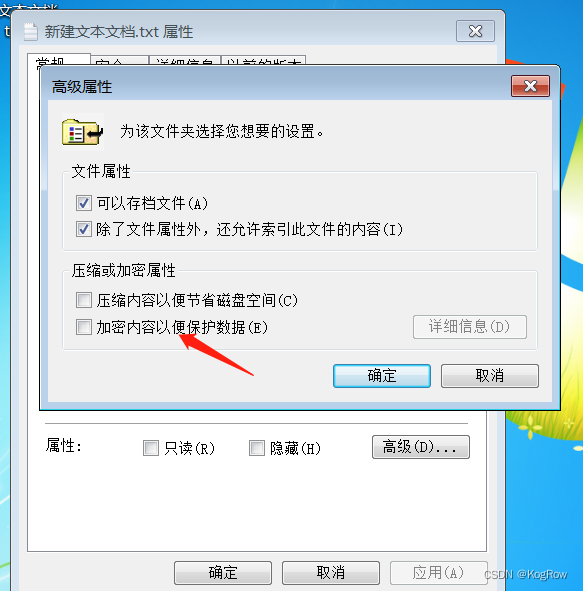
进行上述操作之后可以看到，%UserProfile%\Application Data\Microsoft\下生成了Crypto文件夹：
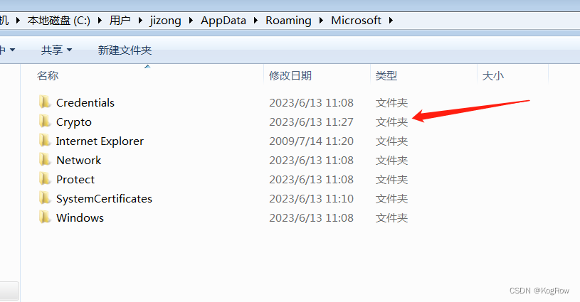
加密后的私钥就存在Crypto文件夹中：
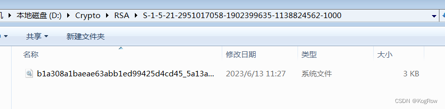
在上面的加密操作中，操作系统会提示你导出证书，这里也测试一下导出证书后删除私钥的功能是不是删除Crypto文件夹的内容：
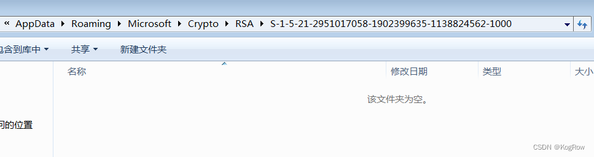
可以看到私钥确实因为导出证书时勾选了“如果导出成功则删除私钥”而被删掉了。

## 0x04 有主密钥和私钥条件下使用AdvancedEFSDataRecovery解密EFS加密的文件
上面的操作中，我把主密钥和私钥以及加密文件拷贝了出来，然后另起一个账户，尝试使AdvancedEFSDataRecovery解密。  
首先切换到另一个账户test:  
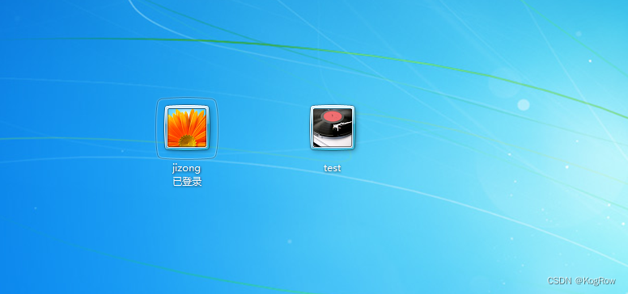
可以看到在test账户下，被加密的文件是绿色的，无法访问：  
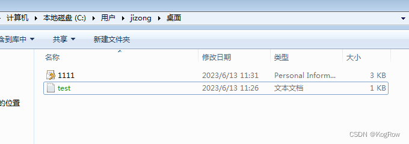
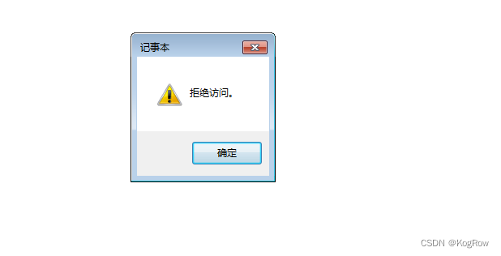
我们使用当前用户安装AdvancedEFSDataRecovery：  
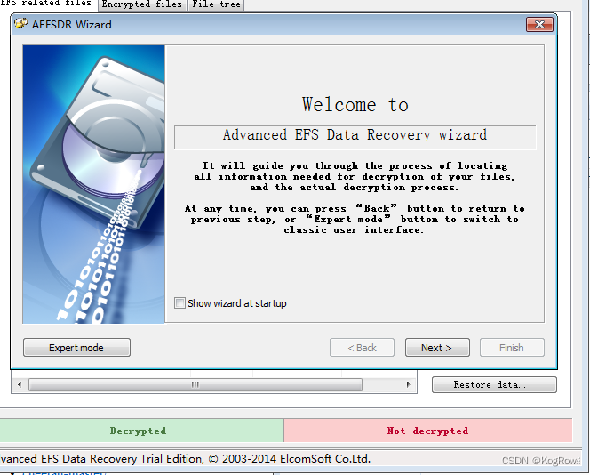
### 1.使用证书解密：
由于之前导出过证书，先测试一下证书解密：  
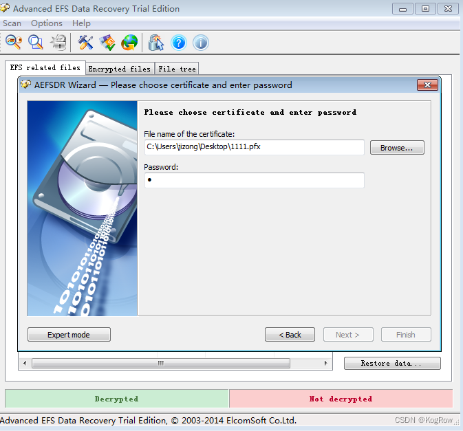
上面的密码是之前导出证书时设置的密码。  
填入证书路径和密码之后按回车，开始扫描：  
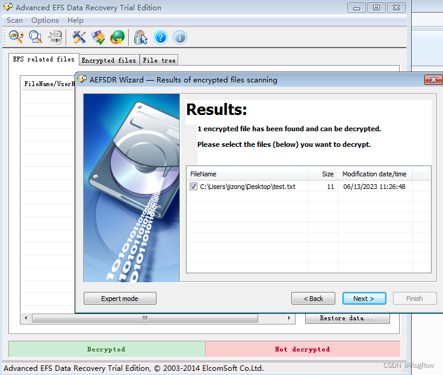
使用证书成功解密：  
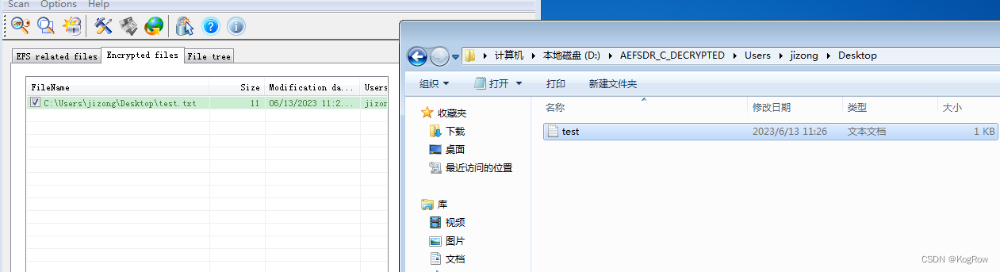
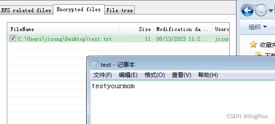
### 2.使用私钥解密：
上面使用证书解密是最简单的情况，但是实际上很多人不会导出证书，就纯手贱要去点一下这个加密。  
现在假设我们手上有主密钥，有私钥，在这种情况下测试使用AdvancedEFSDataRecovery进行恢复：  
之前我们将主密钥和私钥复制了一份放在D盘：  
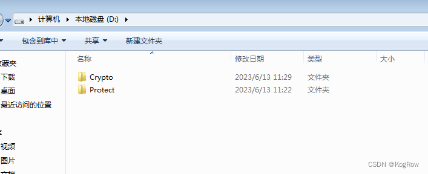
然后回到AdvancedEFSDataRecovery，选择“我没有证书，所以程序应当搜索硬盘以寻找加密密钥”：  
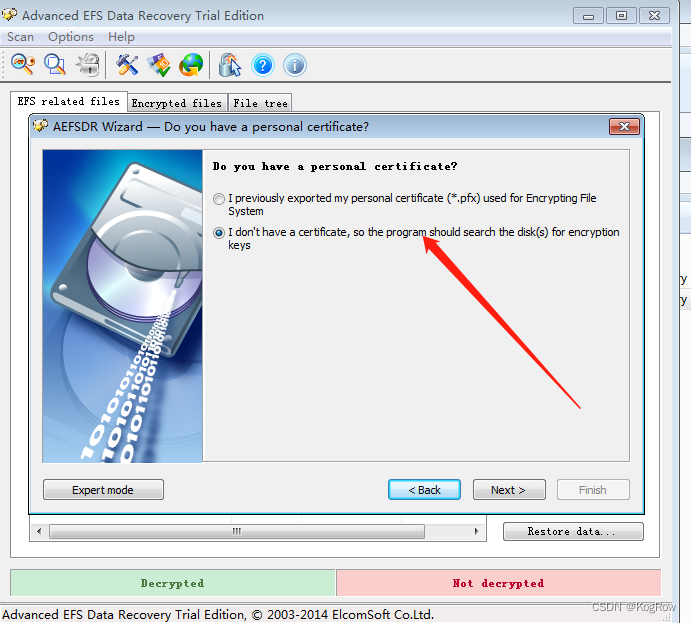
这里把“按扇区扫描”勾上：  
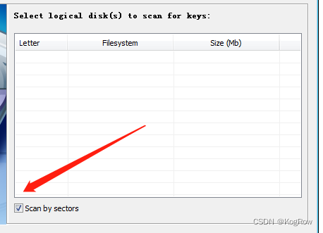

然后得到一个结果，要求输入用户名和密码，这里的用户名和密码必须是加密文件的那个windows账号的用户名和密码，我这里就是jizong/123456。然后提示一个私钥被发现且被成功解密，现在你可以点击next按钮去扫描加密文件：  
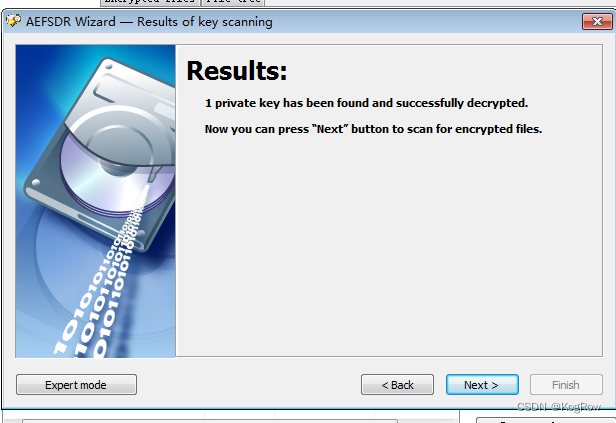
扫描的结果，然后点击next：
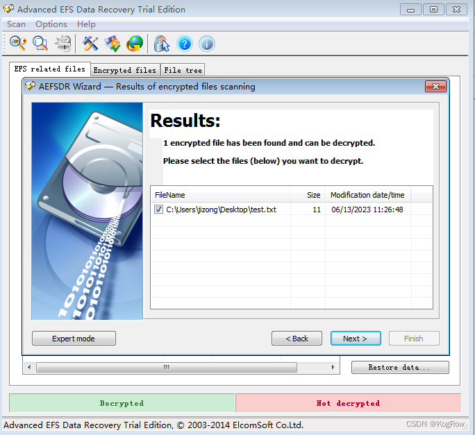
也能解密成功。  

## 0x05 重装系统及私钥丢失情况下的EFS解密（看运气）
本节研究重装系统后，或者私钥被误删而加密文件的windows用户又被删掉情况下的EFS解密。  
这种情况就比较极端了，能不能恢复完全看运气。这些情况下，满足两种前情况中任意一种下罗列的所有条件，则可以恢复：  
情况一 以前导出过证书：  
1.证书能够使用数据恢复工具恢复出来（比如easyrecovery或者winhex、DiskGenius等）  
2.需要记得导出证书时候设置的密码  

情况二 私钥能恢复：  
1.私钥能够使用数据恢复工具恢复出来（比如easyrecovery或者winhex、DiskGenius等）  
2.记得加密文件时使用的windows账户的账号密码  
  
上述两种情况，满足任意一种都能解密，如果不满足，那就很悬了。  

所以，当出现重装系统或账户被删、私钥丢失等极端情况，应不再使用电脑，避免数据被覆盖，直接进入PE，使用数据恢复工具看能不能把私钥或者证书恢复过来。  

下面测试私钥丢失情况下通过DiskGenius恢复私钥，进而解密文件：  
上一节的实践证明，只需要恢复私钥这一个文件，配合账号密码就可以解密，因此，我们将D盘备份的私钥删掉，并清空回收站，然后使用DiskGenius恢复：  

-----------end------------
