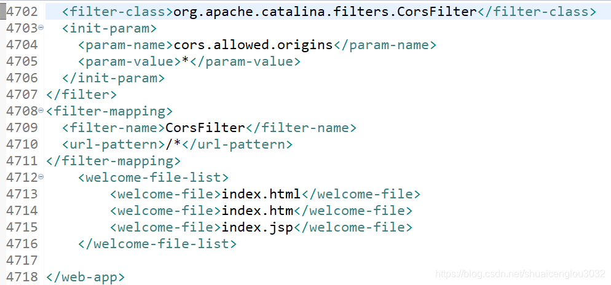

开发React项目时前端通过axios向后端代码发起请求调试的时候由于后端代码运行在8080端口而React项目运行在3000端口导致浏览器的同源策略禁止跨域请求，因此需修改Tomcat配置文件web.xml以开放跨域访问。  

在tomcat的web.xml文件末尾加上：  
```xml
<filter>
  <filter-name>CorsFilter</filter-name>
  <filter-class>org.apache.catalina.filters.CorsFilter</filter-class>
  <init-param>
    <param-name>cors.allowed.origins</param-name>
    <param-value>*</param-value>
  </init-param>
</filter>
<filter-mapping>
  <filter-name>CorsFilter</filter-name>
  <url-pattern>/*</url-pattern>
</filter-mapping>
```  

