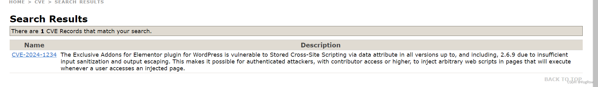

最近因为工作需要，打算弄一个CVE编号。
研究之后发现[VulDB](https://vuldb.com/)这个CNA给编号的速度比较快，所以就它了：
## 0x00 首先要准备好一个0day
## 0x01 VulDB注册
先申请注册一个账号登录。
## 0x02 提交漏洞
然后选择去提交一个漏洞。
（以下必须全英文操作，老外看不懂中文）
  
如上图，点击ENTRIES--->ADD进入漏洞提交页面：
  
Vendor写公司（例如微软）；
Product写具体的产品（例如windows或者wordpress）；
Version写漏洞受影响的版本，比如写<=1.1.1
Class就是漏洞类型，例如RCE，XSS，SQLi等等；
Summary写漏洞的概述。例如：xxxCMS中发现了一个被归类为严重的漏洞。这会影响文件xxx.php的未知部分。对参数DID的操作导致RCE。
下面还有一个Advisory / Proof-of-Concept，这个就弄一个Github项目，在Issues里详细描述你发现的漏洞的分析过程，截图，修复建议等等，力争让漏洞审核人员一眼就懂。
  
填完之后就可以提交了。
然后就会收到VulDB发来的漏洞收到的邮件：  
  
## 0x03 等待  
第一次提交可能会慢点，我提交的流程如下：  
(1)Received.（第一天）  
(2)Needs analysis by our data team.（第二天）  
(3)Needs additional analysis by our data team.（第三天）  
(4)Needs investigation, please be patient.（第四天）   
(5)Needs additional investigation, please be patient.（第五天）  
(6)Contacted external party, please be patient.（第六天）  
(7)Waiting for feedback by external party, please be patient.（第七天）  
(8)Still waiting for feedback by external party, please remain patient.（第八天）  
(9)Asked external party again for feedback, please remain patient.（第九天）  
最终：Accepted（第十天）  
## 0x04 公开CVE编号  
然后就收到了漏洞接收邮件，同时给了四位数的CVE编号：  
  
这时候CVE编号还没公开，别人还查询不到：  
  

接下来就去[CVE](https://cveform.mitre.org/)申请公开漏洞编号：  
  
照我上面的填，Select a request type填Notify CVE about a publication，下面那个框框填邮箱。  
  
底下还有3个框框，照我上面的填。  
然后提交，就会收到CVE的邮件：  
  
然后CVE编号就可以查到了，可以看到有详细的漏洞描述（这个编号并不是我的，我不可能把我的编号放出来，嘻嘻）：  
  
